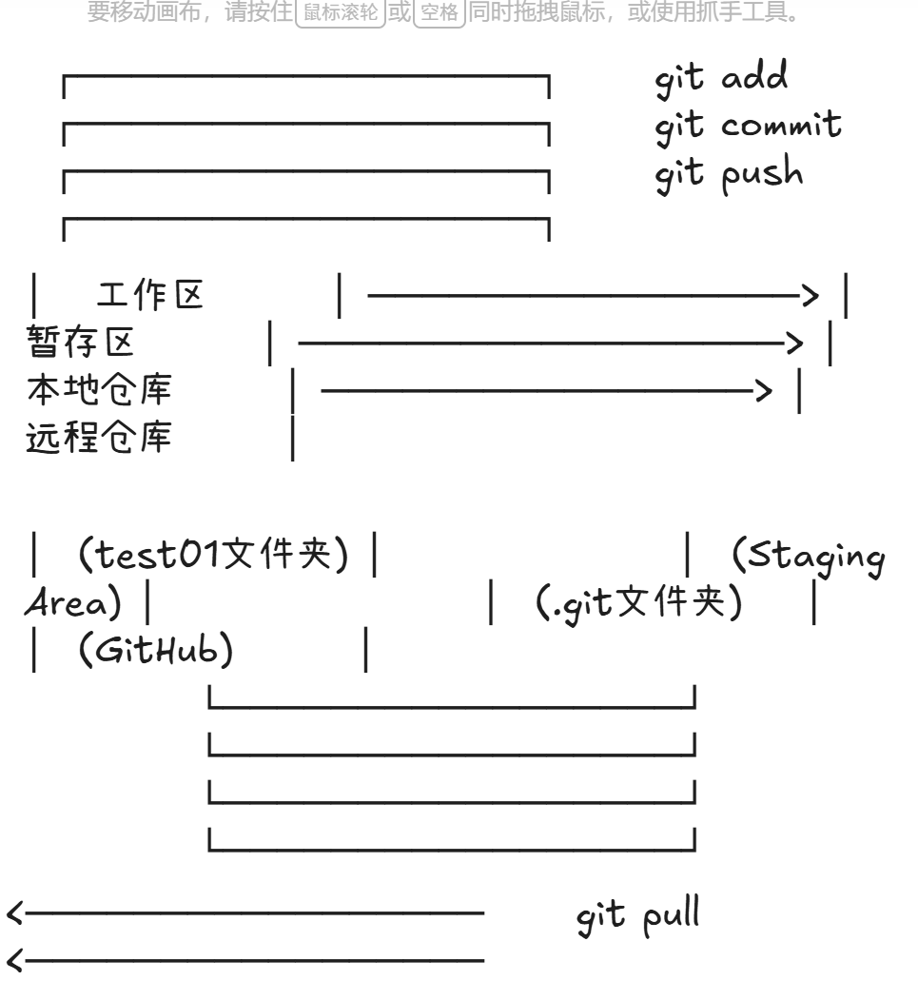

# Git和GitHub

### Git是工具（本地工具）GitHub是平台（云端平台）

**Git本地工具**

- **本质**：一个开源的**分布式版本控制系统**。

- **功能**：记录代码的所有修改历史（谁在什么时候改了什么），支持回滚版本、创建分支等。

- **运行环境**：安装并运行在你自己的电脑上，不需要联网也能使用。

**GitHub云端平台**

- **本质**：一个基于 Git 的**代码托管网站/云端服务**。

- **功能**：你可以把本地代码上传（Push）到这里备份，并与全球开发者**协作**（Pull Request、代码审查、问题跟踪）。

- **特色**：拥有极强的社交属性（点赞、关注），被称为“程序员的社交平台”。
  
  **比喻**

- **Git** 就像是你的**相机**（记录和保存瞬间的工具）。

- **GitHub** 就像是 **Instagram**（把照片分享到网上的平台）。

**核心区别总结：**

| 特性         | Git                              | GitHub                                |
| ---------- | -------------------------------- | ------------------------------------- |
| **类型**     | 本地安装的软件                          | 在线云端服务                                |
| **维护者**    | [Linux 社区](https://git-scm.com/) | [Microsoft (微软)](https://github.com/) |
| **GUI 界面** | 主要是命令行                           | 友好的网页交互界面                             |
| **替代品**    | SVN, Mercurial                   | GitLab, Gitee, Bitbucket              |

##### Git 是你电脑上的“后悔药”和“存档工具”，而 GitHub 是存放这些存档的“云端网盘”

Git是众多版本控制系统中的一种还包括CVS,Subversion,Mecurial,Perforce,Bazaar等

### git 版本管理软件commit你的一次操作

**git**仓库 由多个**commit**构成的

**git**服务器除了**github**还有**gitee，gitlab，coding，aliyun**

#### git是工具，github是网盘 要把代码传到github，必须用git

[liubei123394/my-first-project · GitHub](https://github.com/liubei123394/my-first-project.git)[liubei123394/my-first-project · GitHub](https://github.com/liubei123394/my-first-project.git)

[git常用命令](https://www.doubao.com/thread/aa95eaf98ac9a)

